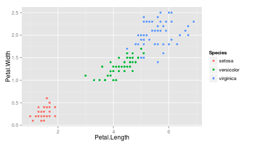
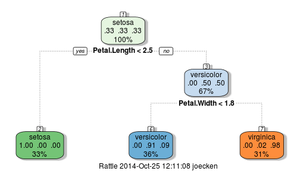

## Identification is Difficult!

### Can you tell the difference?


### Can your clients?

--- .class #slide2

## Enter Guess My Iris!

### Take the guesswork out of plant identification.

1. Enter just a few simple measurements.

2. Let advanced algorithm detect faint data subtleties and return your species.


 

<ol start = "3">
      <li>Profit!</li>
</ol>

--- .class #slide3

## How It Works

Behind the scenes, a complex code emits a powerful prediction algorithm.


```r
fitMod <- train(Species ~ ., data = iris, method = "rpart")
fancyRpartPlot(fitMod$finalModel)
```

 

--- .class #slide4

## Additional Features

- <b>Red herrings:</b> Sepal length and width entered but not used; this gives the
client an inflated sense of accuracy!

- <b>Sliders:</b> Easy to implement, slick, professional!

- <b>Built in documentation:</b> Even new gardeners and new computer users will find
it simple!

### Wish to try it yourself?

Give the app a test run [here](http://kielejocain.shinyapps.io/Project)!
